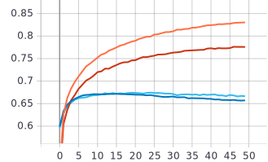

Лабораторная работа 2.
====
# Немного информации о цели лабараторной работы
Обучить нейронную сеть с использованием техники обучения Transfer Learning. В данной работе использовалась нейронная сеть EfficientNet-B0. В первой части работы данная нейронная сеть будет со случайным начальным приближением. Во второй части необходимо использовать предобученную нейронная сеть, поскольку Transfer Learning предполагает использование предварительно обученной нейронной сети.

# 2.обучить нейронную сеть EfficientNet-B0 (случайное начальное приближение) для решения задачи классификации изображений Food-101
* **Описание архитектуры:**
 
* Размерность входного изображения: 
```
inputs = tf.keras.Input(shape=(RESIZE_TO, RESIZE_TO, 3))
```

* Использование нейронной сети EfficientNet-B0 с параметрами: include_top=True, weights=None, classes = NUM_CLASSES. Параметр include_top=True - использование слоев нейронной сети EfficientNet-B0, отвечающих за классификацию. Параметр weights=None задаёт случайное начальное приближение. Параметр classes = NUM_CLASSES -  количество классов для классификации изображений. (у нас 101).
```
outputs = EfficientNetB0(include_top=True, weights=None, classes = NUM_CLASSES)(inputs)
```


 ### Графики обучения для нейронной сети со случайным начальным приближением:
 
Синяя линия - на валидации
Оранжевая линия - на обучении

 ***График метрики точности:*** 


 ***График функции потерь:*** 


### Анализ результатов:
Исходя из графика метрики точности и графика функции потерь видно, что сеть не обучается, поскольку с каждой эпохой точность уменьшается, а потери увеличиваются. Максимальная точность около 35%. Графики точности и потерь на валидационном наборе данных скачущие, можно предположить, что причиной является слабая архитектура сети и маленький набор данных.

# 3. С использованием техники обучения Transfer Learning. Дообучить классификатор нейронной сети EfficientNet-B0 для решения задачи классификации изображений Food-101

* **Описание структуры** 

* Использование нейронной сети EfficientNet-B0 с параметрами: include_top=False, input_tensor=inputs, pooling='avg', weights='imagenet'. 
Параметр include_top=False - использование слоев нейронной сети EfficientNet-B0 без классификации. 
Параметр input_tensor=inputs - подает входное изображение. 
Параметр pooling='avg' - применение глобального среднего объединения к выходным данным последнего сверточного слоя. 
Параметр weights=imagenet - использование предобученного начального приближения на базе imagenet.
Так же будет проведён опыт с параметром drop_connect_rate=0.4 - разрешающий параметр
(по умолчанию drop_connect_rate имеет значение 0.2)


```
x = EfficientNetB0(include_top=False, input_tensor=inputs, pooling='avg', weights='imagenet')(inputs) 
```

* "заморозка" сверточной части, так как мы используем уже обученную нейроную сеть:
```
x.trainable = False
```

* Преобразование многомерного тензора в одномерный
```
 x = tf.keras.layers.Flatten()(x.output)
```

* Полносвязный Dense слой с 20 выходами и функцией активации softmax, которая определяет к какой категории и с какой вероятностью относится поданное на вход изображение:
```
outputs = tf.keras.layers.Dense(NUM_CLASSES, activation=tf.keras.activations.softmax)(x)
```

* Также был изменен тип данных с float32 на unit8, так как для коректной работы Imagenet необходим тип unit8.
```
example['image'] = tf.image.convert_image_dtype(example['image'], dtype=tf.uint8)
```

* В коде была убрана нормализация, так как она уже включена в модель сети. 

 ### Графики обучения для нейронной сети предобученной на базе изображений imagenet:
 
Синяя линия - на валидации
Оранжевая линия - на обучении

 ***График метрики точности:*** 


 ***График функции потерь::*** 
 


 ### Эксперимент с параметром drop_connect_rate
 
Синяя линия - на валидации при drop_connect_rate = 0.2
Оранжевая линия - на обучении при drop_connect_rate = 0.2

Голубая линия - на валидации при drop_connect_rate = 0.4
Красная линия - на обучении при drop_connect_rate = 0.4


 ***График метрики точности:*** 


 ***График функции потерь::*** 
 


### Анализ результатов:


